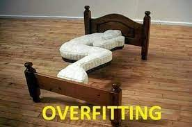

```{r setup, include=FALSE}
knitr::opts_chunk$set(echo = TRUE)

pacman::p_load(tidyverse,ggpubr)

url <- "https://raw.githubusercontent.com/timmarchand/2021-iss-data-science/main/figures/overfitting.jpeg"
```

## Introduction

This document illustrates the typical workflow of handling data:

-   Read in the data

-   Check and wrangle the data of interest

-   Start exploring the data with some visualisation

We are going to work with the africa\_guess data set that was generated by the Random Questions survey. We are specifically going to visualise the data for ISS data science class members only.

## 1 Read in the data

We are going to read in the data saved last time in our data folder.

```{r}
df <- read_csv("../data/africa_guess.csv") # This data should be in your data folder
```

If that doesn't work, uncomment all the code in the following block to grab the data from it's online source.

```{r}
# Uncomment the following:

# df <- read_csv("https://docs.google.com/spreadsheets/d/e/2PACX-1vQul_g9GtsSj-30sQ2hOE_rixxy8gH6AdhawcT5AoRJodJdGZnBgqtwgDAmfab0CJ1AjmFCrKmVw5MA/pub?gid=1799592268&single=true&output=csv")
# 
# names(df) <- c("completed","height","month","date","visit1",">14","n_africa1","visit2","<96","n_africa2","iss_datasci")
# 
# df <- df %>%
#   mutate(visit = coalesce(visit1,visit2)) %>%
#   mutate(n_africa = coalesce(n_africa1,n_africa2)) %>%
#   mutate(birthday = ifelse(is.na(visit1),"even","odd")) %>%
#   mutate(iss_datasci = iss_datasci == "Yes") %>%
#   select(completed, iss_datasci,height,month,date,birthday,visit,n_africa)
# 
# df <- df %>%
#   mutate(month = match(month, month.name))
```

## 2 Check and wrangle the data

The next step is to quickly have a look at the data, and then choose the parts we need. For bigger datasets, the `glimpse()` function is easier to use. Although our dataset is not so big, let's use it here.

```{r}
glimpse(df)
```

We are going to refer to only the ISS data science class members (past and present), so let's filter only those `TRUE` values, and call the new object `df_class`:

```{r}
df_class <- df %>% filter(iss_datasci)

glimpse(df_class)
```

## 3 Exporatory data visualisation

### Numerical response with a categorical (binary) predictor

Let's check out some of the variable associations, first comparing the heights of people born on odd and even days with a density plot. This means we set the height as the outcome or response variable, and separate the odd-even birthdays into two binary categorical predictor or explanatory variables.

```{r}
## height vs birthday
ggplot(df_class) +
  aes(x = height, fill = birthday) +
  geom_density(adjust = 1,alpha = 0.5) +
  geom_rug(aes(colour=birthday)) +
  labs(x = "Height in cm", y = "Probability Density", title = "Are people's heights related to birthday dates?", fill = "birthday date") +
  theme_minimal()
```

We can make a similar comparison with the boxplot:

```{r}
## height vs birthday
ggplot(df_class) +
  aes(x = "", y = height, fill = birthday) +
  geom_boxplot() +
  scale_fill_hue() +
  labs(x = "Birthday date", y = "Height in cm", title = "Boxplot of height by odd/even birthday") +
  theme_minimal()
```

Based on the two plots, you might get an idea about the answer to these questions:

-   Do these plots suggest a difference in the groups?
-   Are the differences significant?

Later we will look at statistical testing in detail, but for now we will use the ggpubr package which prints statistical results onto the results of a boxplot!

For comparing numerical results of categorical data we can use `stat_compare_means()`

```{r, warnings = FALSE}
ggplot(df_class) +
  aes(x = "", y = height, fill = birthday) +
  geom_boxplot() +
  scale_fill_hue() +
  labs(x = "Birthday date", y = "Height in cm", title = "Boxplot of height by odd/even birthday") +
  ggpubr::stat_compare_means(method = "t.test") +
  theme_minimal()
```

> What does the high p-value mean here?

If you know anything about Null-hypothesis testing, then the answer should be clear - there is no evidence that the heights of people born on odd or even birthdays are siginifcantly different (as you'd probably expect!).

### Numerical response with a numerical predictor

In the next case we are going to look for correlations between two numerical variables. The nonsense continues because we are going to try and judge whether someone's height in any way can predict how many countries they guess are in Africa...!

In statistical terms, that makes `height` the explanatory variable this time (aka predictor or independent variable), and `n_africa` the outcome variable (aka response or dependent variable).

The most common way to visualise this is using the scatterplot.

> Can you remember which `ggplot` *geom* to use for a scatterplot?

```{r}
## scatter plots with correlations ----
## simple scatter plots - class
ggplot(df_class) +
  aes(x = height, y = n_africa) +
  geom_point() +
  theme_minimal()
```

In ggplot, you can easily add a line of a model that will fit to the data as closely as possible.

This extra layer the plot is returned with the function `geom_smooth`.

```{r}
## use geom_smooth to add a line of a model fitting the data
## model line - class
ggplot(df_class) +
  aes(x = height, y = n_africa) +
  geom_point() +
  geom_smooth()  +
  theme_minimal()
```

But this line is not straight! The model is probably overfitting the data, which means that while it does a good job of matching our current data, it won't work well as a more general model for new datasets.

The following picture is an example of someone who designed a bed based on an overfitted model!:

```{r, echo=FALSE, out.width='100%'}

```


What we want instead is to tell the `geom_smooth`function to fit a linear model, which is easily done using the `method = "lm"` argument.

```{r}
  ggplot(df_class) +
  aes(x = height, y = n_africa) +
  geom_point() +
  geom_smooth(method ="lm")  +
  theme_minimal()

```

The grey shaded area indicates the 95% confidence intervals for the model. This basically means that if we were to a run a model on a similar sample of the population 100 times, 95 of those times the trend line would be within this grey band.

A wider band indicates a less precise model (higher standard error values), and the greater chance that the statistical result will not be significant.

You can remove these bands from the plot by setting the standard error to FALSE.

```{r}
ggplot(df_class) +
  aes(x = height, y = n_africa) +
  geom_point() +
  geom_smooth(method ="lm" , se = FALSE)  +
  theme_minimal()
```

Finally, as before we can add a layer with statistical test results thanks to function from `ggpur` package. This time let's add R and p values:

```{r}
ggplot(df_class) +
  aes(x = height, y = n_africa) +
  geom_point() +
  geom_smooth(method ="lm")  +
  ggpubr::stat_cor(method="pearson") +
  theme_minimal()
```

> Were you surprised by the statistical results?

There are at least three reasons why they should not be a shock at all:

1.  The number of observations in our df\_class data set is very small

2.  The initial visualisations indicated a relatively flat trend line and large standard errors

3.  And of course the notion that height should influence someone's guess about the number of countries in Africa sounds very unlikely!

Quite often when you are doing data science you can anticipate such results from these 3 perspectives:

1.  details of the data collection

2.  initial exploratory visualisations

3.  theoretical background
