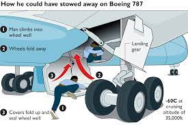
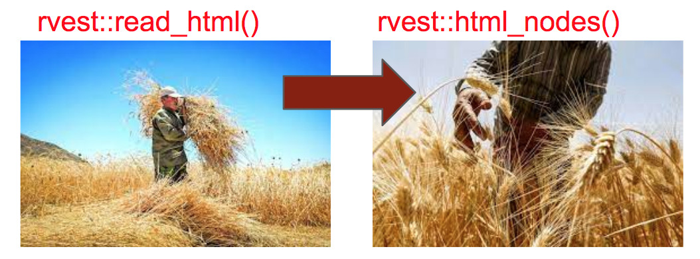
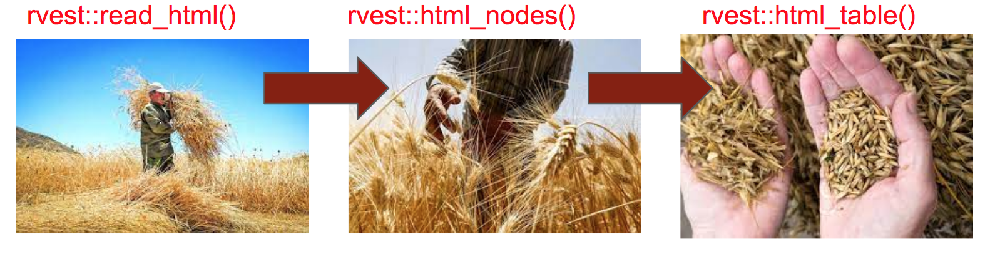
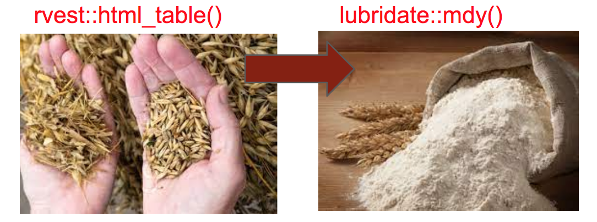
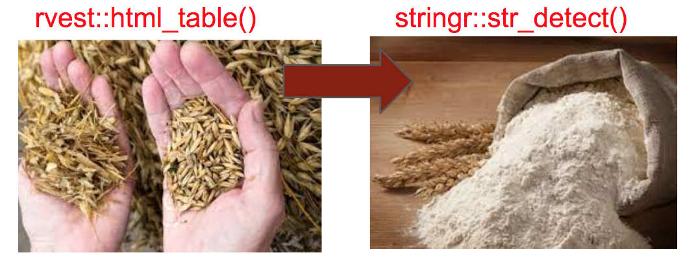

```{r setup, include=FALSE}
knitr::opts_chunk$set(echo = TRUE)
pacman::p_load(rvest, tidyverse, janitor, lubridate)
theme_set(theme_minimal())
```

## Introduction

This is an example of the web scraping process in action. The data involved is from [wikipedia](https://en.wikipedia.org/wiki/Wheel-well_stowaway), and the subject matter is a sensitive one: **Wheel-well stowaways**. 

These are people who attempt to travel in the landing gear compartment of an aircraft, usually in a desperate attempt to escape poverty or some other difficult circumstance. Unfortunately, many of these attempts end in tragedy. In fact, we are going to try and find out what proportion and where the most deadly routes are.

Even though this example should demonstrate the usefulness of web-scraping, it is worth remembering and be resepctful of the fact that there are hundreds of sad stories that lie behind the data.



## Getting the table data

As we have seen before, we know that it is okay to scrape wikipedia, so we don't need to check permissions. Instead, let's save the webpage's url, and grab all the `html` data.



```{r check table nodes}
url  <-  'https://en.wikipedia.org/wiki/Wheel-well_stowaway'

 read_html(url) %>% 
 html_nodes('table')

```

From the immediate output, we can see that there were 5 tables on the page, but that probably the one we want is the first one, which is a `wikitable sortable` type.

Let's select that, and do a quick tidy up with `janitor::clean_name()`:



```{r grab first table}

 stow_raw <- stow_df <- read_html(url) %>% 
 html_nodes('table') %>%
    html_table( fill = TRUE)  %>%
  .[[1]] %>%   # this is the same as purrr::pluck(1)
  tibble() %>%  # to use with dplyr 
  clean_names() %>% # for better column names
  rename (case = stowaway_s) # change to case

stow_df
```


It looks like we have grabbed the details of the table okay, so now we can stop to think what do we actually want to find out. Looking at the information in the table, there are several questions we can answer pretty quickly:

1. From the date column we can ask: When did the stowaways make their attempts? (How are the incidents distributed over time?)

1. From the flight column: What are the most common routes?

1. Which aircraft are most often targetted by stowaways?

The last 2 questions can be answered quite quickly with a bit of `dplyr` wrangling. The first one requires an extra step as the date column is currently a columns of character values (strings).

>
> How would you go about answering these questions?
>

## Dealing with dates

Let's check out the `date` column first though.



Lubridate have a lot of really useful functions for automatically parsing character strings into correct date format. First, let's use the function`mdy`.
Then we'll grab the year and month for each date.

```{r try mdy}
stow_df %>% 
  mutate(date = mdy(date))
```


>
>What do you think `mdy` stands for? 
>When would you use the similar `dmy` or `ymd`?
>

Two failed to parse - let's see why by creating a new variable with `mutate()`, and filter for when the new variable has a `NA` value.

```{r get date info}
## these parse okay
qwe <-   stow_df %>% 
  mutate(date = mdy(date),
         year = year(date), .after = date) %>%
  filter(!is.na(date))


## these don't
asd <-   stow_df %>% 
  mutate(date2 = mdy(date)) %>%
  filter(is.na(date2))
```

The problem is that for these two cases, the date is not fully-formed. We can deal with that with lubridate too: 
```{r deal with year only dates}
 asd <- 
  asd %>% 
  mutate(date = ymd(date, truncated = 2L)) %>% 
   mutate(year = year(date)) %>% 
  select(-date2)
```

By adding the argument `truncated = 2L`, we tell the function `ymd` to expect only a year value.

Let's  bind these two temporary dataframes together to update the `stow_df`.
```{r bind qwe and asd}

stow_df <- 
 bind_rows(qwe,asd) %>% arrange(date)

```


We can now count the years of stowaway incidents, or plot the cases over time with  `ggplot2`.

```{r count years}
stow_df %>% count(year, sort = TRUE)

```

For plotting by year, we need to include all the zero counts as well.
This can be done with `tidyr::expand()`, then rejoin the main dataframe before plotting:

```{r plot year}
stow_df %>% 
  # expand all year values from earliest to latest
expand(year = min(year):max(year)) %>% 
  # rejoin the dataframe (lots of NAs will be produced)
  left_join(stow_df) %>% 
  count(year) %>% 
  ggplot(aes(year,n)) +
           geom_point() +
  geom_line(color = "red") +
  scale_y_continuous(breaks = seq(0,10,2)) +
  scale_x_continuous(breaks = seq(1945,2020,5)) +
  labs(y = "Number of wheel-stowaway incidents")
```

>
> What would happen to the plot if we did not expand it to include missing years? 
> Add a # to the expand(year = min(year):max(year)) to find out.

## Counting strings

The last two questions can also be answered using the `count()` function. Let's do that now:

```{r counting}
stow_df %>% 
  count(aircraft, sort = TRUE) 

```

For aircraft, it looks like we have some missing values (the empty "" with a count of 16). Let's replace those with NA values (plus any other empty strings in the table). They can be easily filtered out later, if necessary.

```{r filter empty}
## the dplyr way
stow_df <- 
  stow_df %>% mutate(across(where(is.character), ~ na_if(.x, "")))
# Read as mutate across where the column is a character vector the function:
# change to na if in each case of an empty string
```

Let's count again, this time plotting the output for the top 10. 

>
> Can you remember where we plotted counts before? Try and do a search of your r_docs folder to find out.
> 

```{r count and plot aircraft}
stow_df %>% 
  count(aircraft, sort = TRUE) %>% 
  drop_na() %>% 
  # very useful code to reorder before plotting - keep a note!
  mutate(aircraft = fct_reorder(aircraft, n)) %>% 
  head(10) %>% 
  ggplot(aes(n, aircraft)) +
  geom_col() +
  scale_x_continuous(breaks = seq(0,12,2))
```

>
>Now  **copy**, **paste** and **tweak** the above to count routes from the flight column.
>

```{r copy, paste and tweak}
# stow_df 
```
<br>
<details>

```{r count and plot flight}
stow_df %>% 
  count(flight, sort = TRUE) %>% 
  drop_na() %>% 
  # very useful code to reorder before plotting - keep a note!
  mutate(flight = fct_reorder(flight, n)) %>% 
  head(10) %>% 
  ggplot(aes(n, flight)) +
  geom_col()
```

</details>
<br>

The results of counting the `aircraft` and `flight` variables were quite revealing, but we can do a bit better by tidying up some of the details. For a start, several of the aircraft had more than one way of being written, and any difference in the text string will be counted differently.

Let's deal with that first.

```{r check distinct aircraft}
stow_df %>% 
  # distinct finds all the unique values of a variable
  distinct(aircraft) %>%  
  arrange(aircraft) %>% 
  # print all the rows, not just first 10
  print(n = Inf)
```


>
>Why did we use arrange() here? Put the answer as a comment above the arrange(aircraft) line of code.
>

The advantage of putting things in alphabetical order is that we can quickly see patterns that might be useful when we try and organise text data. Looking at the `aircraft` values, there are some things to notice:

- there is a general pattern of **Manufacturer** [space] **Model** (`Airbus A330` etc.)

- sometimes the **Model** has extra details which may not be necessary (`Boeing 777-200` etc.)

- sometimes the **Manufacturer** is written after other details (`US Military Boeing C-17` etc.)

When cleaning up text data like this, it's recommended to find a general rule that applies to most cases, then deal with the exceptions.

>
>1. Make a rule for the general
>2. Deal with the exceptions
>

When it comes to the manufacturer of the aircraft, the general rule might be to extract the first word of the string. Let's see what that looks like.

```{r extract first word from aircraft}
stow_df %>% 
  # general rule
  transmute(manufacturer = str_extract(string = aircraft, pattern = "^.+?\\b")) %>% 
  distinct(manufacturer) %>% 
  print(n = Inf)

```

A couple of things to note in the code above. First, I use `transmute()` which does the exact same job as `mutate` except it only keeps the columns named - so in a way it is like `mutate()` and `select()` combined. I've used it because at this stage it is easier to see what is going on without the other columns.

The other important thing to notice is that we have used an important function from the `stringr` package, `str_extract()`. This function can be read a **string extract**, or in the context above **string extract from the string `aircraft` the pattern "^.+?\\b"**. 

The last part is an example of a **regular expression**, often shortened to **regex**, which is one of the most fundamental ideas behind processing text data on a computer - used by all computer programming languages, and even every time you do a Google search.

We'll discuss the **regex** in much more detail later, but for now it is enough to know that the regex pattern captures the first word in the full text string.

So looking at the results, what are the exceptions?

>
>How many of the rows above are exceptions to the rule?
>

Sometimes, this is where knowledge of the field can be crucial in data science. Our general rule didn't work in the following cases:

- row 4: "Sud" should be "Sud Aviation"
- row 7: "McDonnell" should be "McDonnell Douglas"
- row 5,6 & 12 Are all examples of where the manufacturer was embedded later in the string

Let's deal with them in turn by mutating the manufacturer column on a case-by-case basis. This can be done with the helper function `case_when()` - pay attention to the special use of `==` and `~`:

```{r mutate manufacturer with case_when}
stow_df <- 
  stow_df %>% 
  # general rule
  mutate(manufacturer = str_extract(aircraft, "^.+?\\b")) %>% 
  # exceptions
  mutate(manufacturer = case_when(manufacturer == "Sud" ~ "Sud_Aviation",
                                  manufacturer == "McDonnell" ~ "McDonnell_Douglas",
                                  manufacturer == "BWIA" ~ "Lockhead",
                                  manufacturer == "U" ~ "Lockhead",
                                  manufacturer == "US" ~ "Boeing", 
                                  TRUE ~ manufacturer))
```

Let's now turn to extract the model of each aircraft. 

>
>As a general rule, where can we find the details for the model of the aircraft?
>

This is a bit trickier because the list of exceptions seems quite long, but as a starting point, let's remove the **manufacturer** details which identified as a genreal rule just now. This time we use the function `str_remove()`:

```{r remove first words to find model}
stow_df %>% 
  transmute(model = str_remove(aircraft, "^.+?\\b")) %>% 
  distinct(model) %>% 
  print(n = Inf)
```

This has removed most of the manufacturers, with some exceptions and with some extra details we don't want as well. The following code deals with the exceptions in a case-by-case way too, but rather than creating new strings for each case, it just removes the unwanted details. Try to work out which row(s) in the tibble above each line deals with:

```{r clean model strings}
stow_df <- 
  stow_df %>% 
  # general rule
  mutate(model = str_remove(aircraft, "^.+?\\b")) %>% 
  # exceptions
  mutate(model = str_remove(model,"Aviation "),
         model = str_remove(model,"Douglas "),
         model = str_remove(model, "Military Boeing "),
         model = str_remove(model,"\\.S\\. Air Force Lockheed "),
         model = str_remove(model," West Indies Airways Lockheed "),
         model = str_remove(model, "\\[\\d+\\]$"),
         model = str_remove(model, "-\\d{3,}(..)?$"), 
         
         # one of my favourite functions for deleting extra whitespaces
         model = str_squish(model))
```

Finally, let's combine our cleaned-up `manufacturer` and `model` variables back together again by creating a new `airplane` column with a **combined** version of the two, and then plot a new count of airplanes. Note that when we use `str_c()` here, we specify the separator as an underscore using the `sep = "_"` argument.

```{r create airplane and plot}
stow_df <- 
  stow_df %>% 
  mutate(airplane = str_c(manufacturer, model, sep="_"), .after = aircraft) 

stow_df %>% 
  count(airplane) %>%
  drop_na() %>% 
  # very useful code to reorder before plotting - keep a note!
  mutate(aircraft = fct_reorder(airplane, n)) %>% 
  head(10) %>% 
  ggplot(aes(n, aircraft)) +
  geom_col()
```

Comparing this plot and the one we tried earlier on `aircraft`, we can see that we had under-counted many of the Boeing aircraft.

## Extracting information from strings

Let's now turn to some other data. The `stowaways_fate` column shows text that explains in detail the fate of the stowaway. In order to process that, we need to do some more manipulation on the text strings using the `stringr` package.

To make things easier, let's make a smaller version of the dataframe by selecting only the columns we are interested in, plus another column to index the results. We can create a temporary dataframe, and join it back to the main one later.

>
> Which columns do you think we should select and why?
>

```{r select subset for qwe}
qwe <- 
  stow_df %>% select(date, case, stowaways_fate)
```

>
>Note that I often use **qwe**, **asd** and **zxc** when making temporary dataframes - can you guess why?
>

```{r display qwe}
qwe
```



A quick look at the `stowaways_fate` reveals that the words **survived** and **died** are used to indicate what happened to the stowaways. We can use the function `stringr::str_detect()` to detect when shorter text strings (such as "survived") are present in longer passages of text (such as each row of `stowaways_fate`). If detected, it will return a TRUE value, if not FALSE.

```{r detect survived}
stow_fate <- 
qwe %>% 
    mutate(survived = str_detect(stowaways_fate, "[Ss]urvived")) %>%
    mutate(died = str_detect(stowaways_fate, "[Dd]ied")) 
 stow_fate
```

In the code, you may notice that we searched for "[Ss]urvived" and "[Dd]ied". This is another  example of a **regular expression**.

>
> What do you think [Ss] or [Dd] means?
>

Here, the square brackets mean **capture any item from this [ ] group of characters**. In other words, `[Ss]urvived` will detect each time either "Survived" or "survived" are in the text string.

Note that however many characters are in the square brackets, it will only capture one at a time. For example, `[Oo]saka` would capture either "Osaka" and "osaka", but not "Oosaka."

If you wanted to capture "Oosaka" too, the you can use the **regex** `[Oo]+saka`. Here, the `+` sign means **plus any number of the same**, so `[Oo]+saka` would capture "Oosaka" as well as "OoOoOsaka".

Let's see whether we get consistent results with these new columns. You would not expect for `survived` and `died` to be true at the same time, so let's filter on both those columns and see. Remember, when you use `dplyr::filter()`, you return only the rows for which the condition is `TRUE`, so if you filter on a column of logical variables, you drop all the `FALSE` rows.

```{r both TRUE?}
stow_fate %>% 
  filter(survived) %>%
  filter(died) %>% 
  select(stowaways_fate)
```

It looks like we have three cases in which more than one stowaway met with different fates. This means that each row may contain more than one observation, which goes against the principle of **tidy data**, and may be something we want to address later.

Rather than increase the number of rows in our data, instead we will just be careful to define our terms: each row then is a recorded incident of wheel-well stowaways occurring, and the "survived" and "died" variables can be changed to "somebody_survived" and "somebody_died".

How about the other case where both of the new columns are `FALSE`? 
```{r both false?}
stow_fate %>% 
  ## Return a TRUE value when the value is FALSE
  filter(survived == FALSE) %>%
  filter(died == FALSE) %>% 
  select(stowaways_fate)
```

Sadly in this case, a fatality occurred, so let's add some text to this column and then rerun the `str_detect` code from above again.

```{r add death and died}
stow_fate <- 
  stow_df %>% 
  mutate(stowaways_fate = str_replace_all(stowaways_fate, pattern = "death", replacement = "death and died")) %>% 
  mutate(somebody_survived = str_detect(stowaways_fate, "[Ss]urvived")) %>%
    mutate(somebody_died = str_detect(stowaways_fate, "[Dd]ied")) 

```

Quick check we have no uncounted rows:
```{r check no double false}

   stow_fate %>% 
  ## Return a TRUE value when the value is FALSE
  filter(somebody_survived == FALSE) %>%
  filter(somebody_died == FALSE)
  
```

Now that we have processed that, we can join the subsetted dataframe back to the main one.

```{r join stow_fate to stow_df}
stow_df <- 
  stow_fate %>% left_join(stow_fate,.)
```


## Processing the filght information

Now let's return to the routes. As before, when checking out some part of the data, it is worth just selecting the columns of interest and also an id column. 
```{r select columns for flight info}
zxc <- stow_df %>% 
  select(date,flight)

zxc
```

A quick look at the flight column reveals that several routes include the names of airlines in brackets. These will be identified and counted differently to the same routes without the brackets, and don't add any information that we need for now, so let's remove them with `str_remove()` which as we saw before, searches for a pattern, then removes it.

```{r remove bracketed info}
zxc <- zxc %>% 
  mutate(flight = str_remove(flight, "\\(.+\\)"))

```

Again, we have used some **regex**, this time though it is a bit harder to understand at first glance. Some characters in regex have special meaning. We saw earlier that `[ ]` had the meaning of selecting characters from a group, and that `+` had the meaning of **plus any number of the same**.

In  **regex** :

- `.` can mean **any character (wildcard)**
- `+` can mean **plus any number of the same**
- `(` can mean **beginning of a string group**
- `)` can mean **end of a string group**

Because the `( )`  has a special meaning in **regex**, we have to do something extra to escape that special meaning, and only capture the **literal** left-hand and right-hand brackets. That is what the `\\` do - they escape the normal  function of `( )`, and let us capture the literal characters instead.

So to read `\\(.+\\)` as **regex**, you can say aloud: "capture the **literal left-hand bracket then any character repeatedly until a literal right-hand bracket**." 

```{r count flight routes}
zxc %>% count(flight, sort = TRUE)
```

Before going further, you might notice something strange with the `Abidjan–Paris\n` flight. What do you think `\n` means?

In  **regex** :

- `\n` means **add a new line**
- `\t` means **add a tab**

These are basically printing instructions that are captured in the web scrape. We can get rid of them all easily with the function `str_squish()`. This will also eliminate any trailing whitespaces.

```{r str_squish count flight routes}
zxc <- 
  zxc %>% 
  mutate(flight = str_squish(flight))

zxc %>% count(flight, sort = TRUE)
```


Looking at the counts of the flight column again, it looks like there is a pattern of **Departure-Destination** for the routes. Let's test this by counting the `-` signs, and seeing what we get:

```{r arrange minus}
zxc %>% 
  mutate(dash = str_count(flight,"-"))%>% 
arrange(-dash)
```

Hmm, we have discovered two problems here. The first is that "Pointe-à-Pitre" has two `-` in it's name. The other is that most routes do not seem to have any dashes at all, even though we can see them right there! What is going on?

If you copy one of the apparently ignored dashes and paste into the code above, you'll see that there are actually two different kinds of dashes in the flight column. 

```{r arrange en dash}
zxc %>% 
  mutate(dash = str_count(flight,"–"))%>% 
arrange(-dash)
```

The first one we tried was the *minus* sign, the second one is slightly bigger and known as the *en dash.* Now let's deal with the two exceptions with the minus signs first (also tidying up some details), then change all the en dashes to underscores instead.

```{r tidy and replace en dash}
route_df <- 
  zxc %>% 
  mutate(flight = str_replace(flight,"a-B","a–B"),
         flight = str_replace(flight, ", GUA-Miami, FL","–Miami")) %>% 
  mutate(flight = str_replace_all(flight,"–","_")) 


route_df %>% 
  mutate(count = str_count(flight,"_")) %>% 
arrange(count)
```

Remember:

>
>1. Make a rule for the general
>2. Deal with the exceptions
>

So now the exception is that some flights are not recorded in the same format. Let's deal with all those with 0 count values for the underscores, in other words the routes with missing departure or destination information. 

```{r replace missing locations}
 route_df <- 
  route_df %>% 
  mutate(flight = str_replace(flight,"^To\\s", "Unlisted_")) %>% 
  mutate(flight = str_replace(flight, "\\sto\\sthe\\s", "_")) %>% 
  mutate(flight = str_replace(flight, "Kabul, Afghanistan", "Kabul_Unlisted"))
```

Let's look at some of the  **regex** here:

- `^`  is an *anchor* character that means **start of string**
- `\\s`  means **any whitespace character**

Therefore `^To\\s` is **regex** to capture when a string starts with "To" and is followed by a space, or `To `.

For reference:

- `$`  is an *anchor* character that means **end of string**
- `\\w`  means **any word character (`a`, `B`, `c` etc.)**
- `\\d`  means **any digit (`1`, `2`, `3` etc.)**

Now we are very close to being able to separate the flight column into two new ones: one for departure cities and one for destinations. 

The general pattern we have is `Departure_Destination`, but it is slightly confused by the fact that some of the flights also have stopovers at midpoint destinations, as revealed when arranging a count of underscores in descending order:

```{r count underscores}
route_df %>% mutate(count = str_count(flight, "_")) %>% 
  arrange(-count) 
```

We'll deal with that soon, but first lets use some more **regex** to grab the two columns we want:

```{r extract for new columns}
route_df %>% 
  tidyr::extract(flight, into = c("dept","dest"), regex = "^(.+)_(.+)$") 
```

In this case we are using the `extract` function from the `tidyr()` package. This a bit of a short cut, and equivalent to combining `mutate()` and `str_extract()` in one go.

How does the **regex** work here? Well, we've seen these characters before:

- `^`  is an *anchor* character that means **start of string**
- `$`  is an *anchor* character that means **end of string**
- `.` can mean **any character (wildcard)**
- `+` can mean **plus any number of the same**
- `(` can mean **beginning of a string group**
- `)` can mean **end of a string group**

Here we actually want the `( )` for their functional usage. The **regex** `^(.+)_(.+)$` captures two groups within the brackets, which form the two columns extracted by the `tidyr` function. The separator `_` is not captured.

But what happened to all the transit stops?

```{r arrange length of dept}
route_df %>% 
  tidyr::extract(flight, into = c("dept","dest"), regex = "^(.+)_(.+)$") %>% 
  arrange(-str_length(dept))
```

They were all captured in the first group, so let's make a new column to take care of them.


```{r create transit and inspect}
route_df %>% 
  tidyr::extract(flight, into = c("dept","dest"), regex = "^(.+?)_(.+)$") %>% 
  tidyr::extract(dest, into = c("transit", "dest2"), regex = "(.+)_(.+?)$", remove = FALSE) %>% 
  transmute(date,dept, transit, dest = ifelse(is.na(transit), dest,dest2)) %>% 
  arrange(-str_length(transit))
  
```


>
>The two captured groups themselves have slightly different **regex** too - can you spot the difference?
>

The difference between the two illustrates the difference between **lazy** and **greedy** matching:

- Greedy: Keep searching until condition is not satisfied.
- Lazy: Stop searching once condition is satisfied.

By adding the `?`, we make the first search group **lazy** - the matching stops as soon as it meets the first `_`. If we remove the `?`, it would keep matching past the first `_` because `_` also satisfies the match for `.+`, the wildcard for any character.

We then mutate the `dest` column to be equal to `dest2` for only when `transit` has a value. Note that `transmute()` is equivalent to `mutate()`, but automatically drops unnamed variables from the result. A visual check on the longest `transit` strings confirms that the two extractions have worked.

```{r create the dest transit dept columns}
## create the dept transit and dest columns
 route_df <- 
  route_df %>% 
  tidyr::extract(flight, into = c("dept","dest"), regex = "^(.+?)_(.+)$") %>% 
  tidyr::extract(dest, into = c("transit", "dest2"), regex = "(.+)_(.+?)$", remove = FALSE) %>% 
  transmute(date,dept, transit, dest = ifelse(is.na(transit), dest,dest2))
```


We are nearly ready to let the new columns rejoin the main dataframe, but before we do, let's check the distinct values for both.

```{r check dept values}
route_df %>% 
  arrange(dept) %>% 
  distinct(dept) %>% 
  print( n = Inf)
```

```{r check dest values}
route_df %>% 
  arrange(dest) %>% 
  distinct(dest) %>% 
  print( n = Inf)
```

>
> What exceptions should we deal with in these columns?
>

If you look at the departure points starting with `Mali`, you can see that there is a trailing whitespace we need to deal with, and also an ambiguity for one flight departing from `Mali or Gabon`. You could leave it as it is, or change it to one of the locations as you like. Also, we have `London Stansted` listed, which is an airport name and should be changed to `London`.

```{r modify route df dept}
route_df <- 
  route_df %>% 
  mutate(dept = str_squish(dept)) %>% 
  mutate(dept = case_when(dept == "London Stansted" ~ "London",
                          dept == "Mali or Gabon" ~ "Mali",
                          TRUE ~ dept))
```

As for the destination list, we have both `New York` and `New York City`, and `Paris` / `Paris?` listed. Let's simplify those too. Then finally we are ready to create a new column for the route by combining the `dept` and `dest` values. We can do this with another shortcut from the `tidyr` package `unite()` which is similar to combining `mutate()` and `str_c()` in one function.

```{r  modify route_df dest}
route_df <- 
  route_df %>% 
  mutate(dest = case_when(dest == "New York City" ~ "New York",
                          dept == "Paris?" ~ "Paris",
                          TRUE ~ dest))
```


```{r  unite to create route}
route_df <- 
  route_df %>% unite("route", dept,dest, remove = FALSE)
  
```

Now we are  ready to let our smaller dataframe rejoin the main one.

```{r rejoin flight with stow_df}
stow_df <- 
  stow_df %>% inner_join(route_df) 
```

We can now process different counts to find out some details:

```{r example stow_df counts}
stow_df %>% count(route, sort = TRUE)
stow_df %>% count(dept, sort = TRUE)
stow_df %>% count(dest, sort = TRUE)
```

## Analysing the results

The updated version of the stow_df has a lot of added information, but how can we use it?

>
> How would you define the most dangerous routes, destinations or aircraft etc. for stowaways?
>

A route could be defined as dangerous by comparing the counts of those who died with those who survived. For this, it would make sense to look at both absolute counts with relative counts.

```{r arrange most survived destination sum}
(most_survived_dest_total <- 
  stow_df %>% 
group_by(dest) %>% 
  # here we use across() to summarise across multiple variables at the same time
  summarise(across(starts_with("somebody"), list(sum = sum))) %>% 
  # survival probability is the proportion of those who survived divided the total
  mutate(survival_prob = somebody_survived_sum / (somebody_died_sum + somebody_survived_sum)) %>% 
  # arrange in descending order
  arrange(-somebody_survived_sum))
```

According to this metric of absolute counts, London is the second most survivable destination, even though proportionally only around 20% of people do survive.

```{r arrange most survived destination probability}
(most_survived_dest_proportion <- 
    stow_df %>% 
group_by(dest) %>% 
  summarise(across(starts_with("somebody"), list(sum = sum))) %>% 
  mutate(survival_prob = somebody_survived_sum / (somebody_died_sum + somebody_survived_sum)) %>% 
  arrange(-survival_prob))
```

It makes more sense to arrange by survival proportions, although this naturally favours destinations with only one case.

```{r arrange most survived destination combined}
(most_survived_dest_combined <- 
    stow_df %>% 
group_by(dest) %>% 
  summarise(across(starts_with("somebody"), list(sum = sum))) %>% 
  mutate(survival_prob = somebody_survived_sum / (somebody_died_sum + somebody_survived_sum)) %>% 
  arrange(-survival_prob, -somebody_survived_sum))
  
```

The best solution would be to combine the two, by arranging first by survival probability and then by the sum counts as above. You could even add a filtering step:

```{r}
most_survived_dest_combined %>% 
  filter(somebody_survived_sum > 1)
```

If we wanted to compare the most survivable and the most fatal across the different variables, we could do the copy, paste and tweak method several times, after changing the arrange order in the case of most fatal. However, as a general rule if you find yourself copying and pasting more than 3 times, it is more efficient to make a function instead.


```{r functions for arranging survivability}
most_survivable <- function(var){
  stow_df %>% 
    group_by({{var}}) %>% 
    summarise(across(starts_with("somebody"), list(sum= sum))) %>% 
  mutate(survival_prob = somebody_survived_sum / (somebody_died_sum + somebody_survived_sum)) %>% 
  arrange(-survival_prob, -somebody_survived_sum)
}

most_fatal <- function(var){
  stow_df %>% 
    group_by({{var}}) %>% 
    summarise(across(starts_with("somebody"), list(sum= sum))) %>% 
  mutate(survival_prob = somebody_survived_sum / (somebody_died_sum + somebody_survived_sum)) %>% 
  arrange(survival_prob, -somebody_died_sum)
}


```

You can then feed the different variables into the functions:

```{r examples from most_fatal function etc}
most_fatal(dest)
most_fatal(airplane)
most_survivable(dept) %>% filter(somebody_survived_sum > 1)
```

## Review

#### stringr()

In this tutorial we worked through several functions from the `stringr` package.

>
> In this document complete the following list by explaining what each one does and why you might use it in your own words
>

##### str_c()

##### str_count()

##### str_detect()

##### str_extract()

##### str_length()

##### str_remove()

### Regex

Here are some of the regexes that was used in this review:

- `.` can mean **any character (wildcard)**
- `+` can mean **plus any number of the same**
- `(` can mean **beginning of a string group**
- `)` can mean **end of a string group**

- `\n` means **add a new line**
- `\t` means **add a tab**

- `^`  is an *anchor* character that means **start of string**
- `$`  is an *anchor* character that means **end of string**
- `\\` is an *escape* character that means  **literal**

- `\\w`  means **any word character**
- `\\d`  means **any digit**
- `\\s`  means **any whitespace character**
- `\\b`  means **any word boundary**
- `?` can indicate **lazy matching**

>
>Based on what you have learned, explain in your own words why `"^.+?\\b"` captures only the first word of a text string. Can you think of any alternatives?
>

##### Regex `"^.+?\\b"`

>
>Look back at the `clean model strings chunk`, can you work out what the regex `"\\[\\d+\\]$"` matches from the model column?
>

##### Regex `"\\[\\d+\\]$"`


### Analysis

>
> How could you use visualise the output of the function `most_fatal()` with the ggplot2?
>

```{r}
### ggplots here
```


