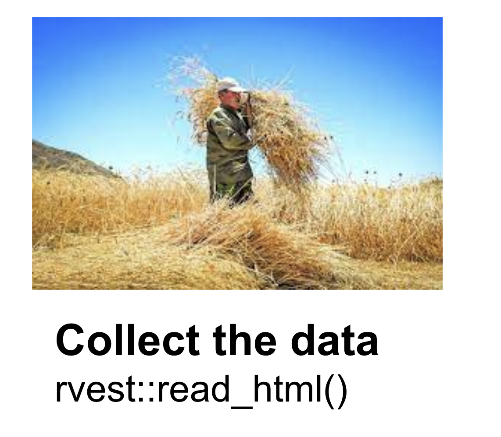
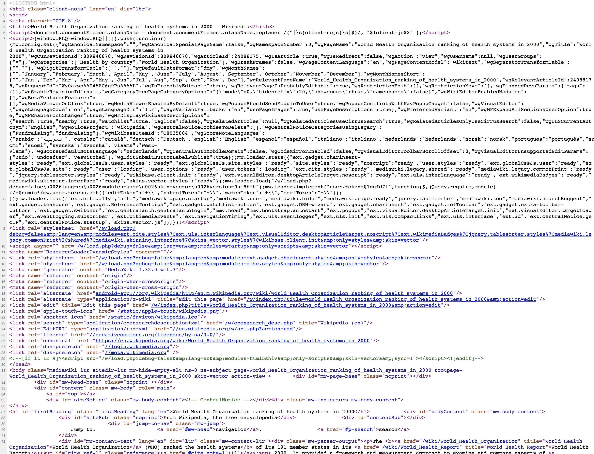
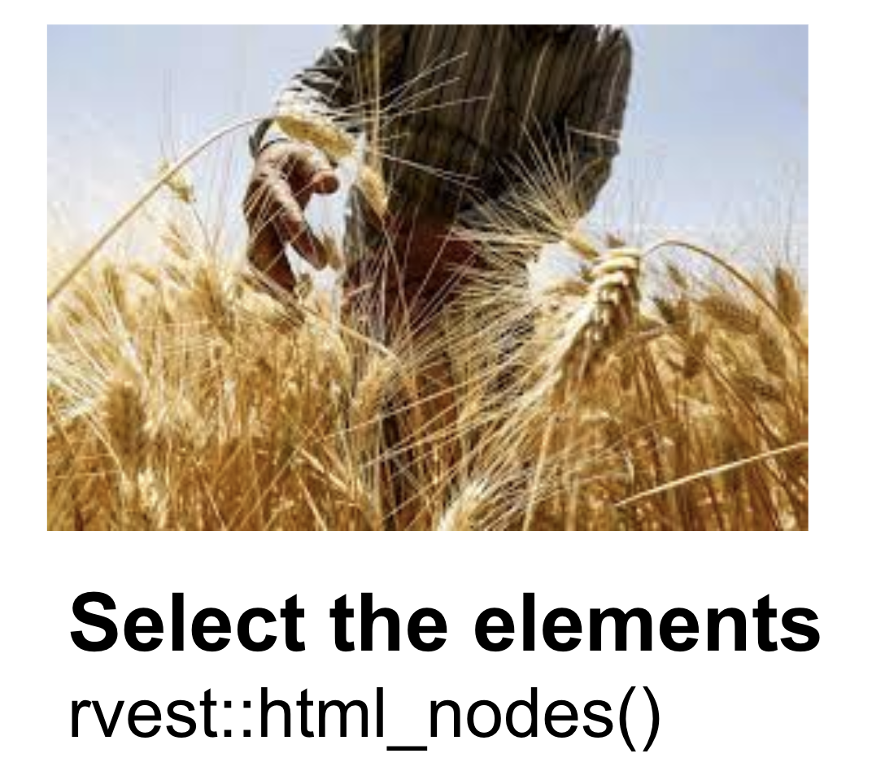
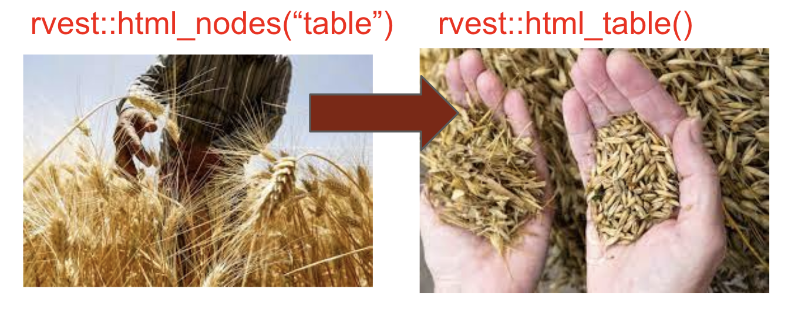
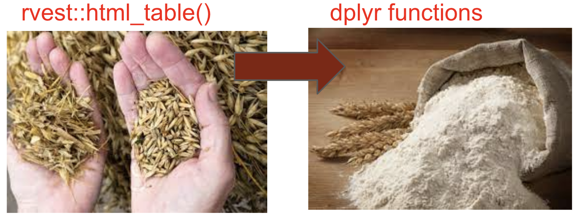
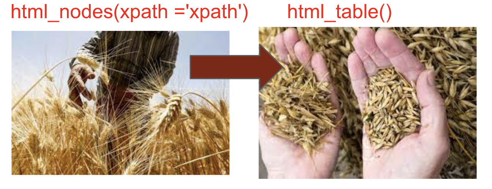
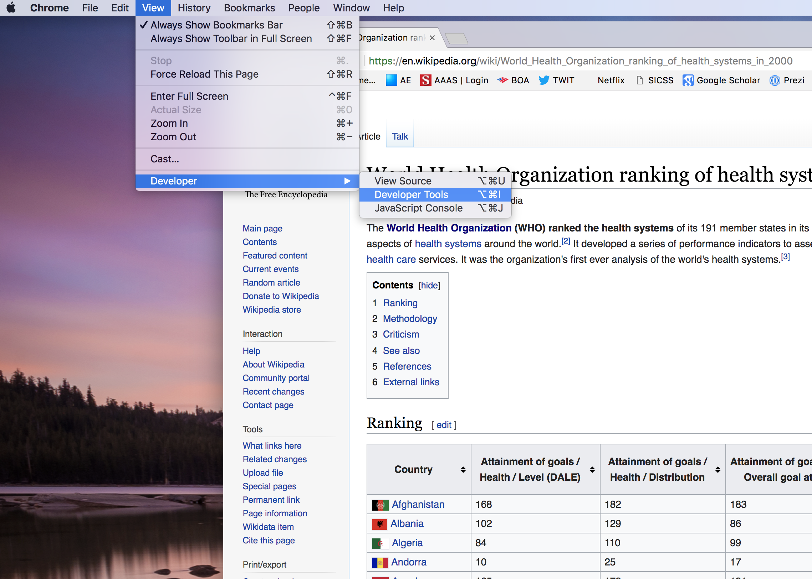
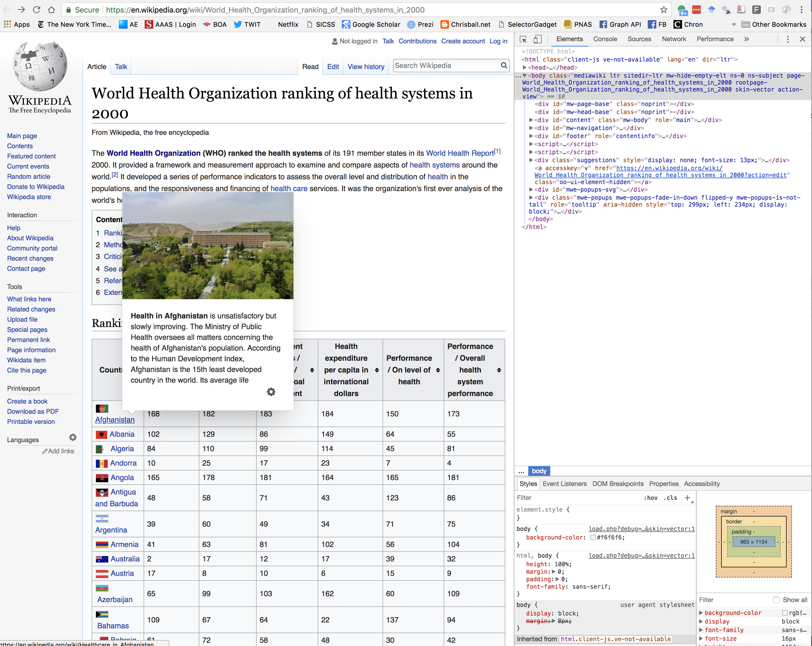
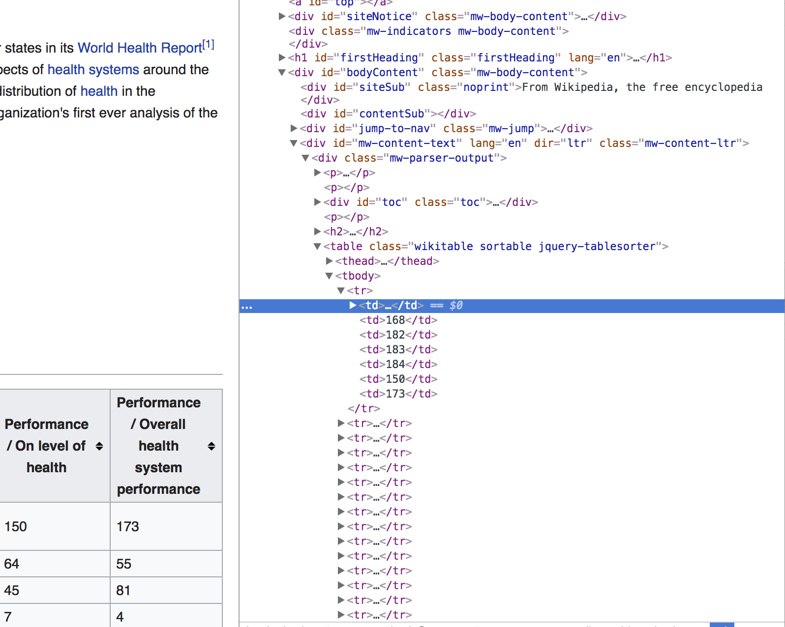
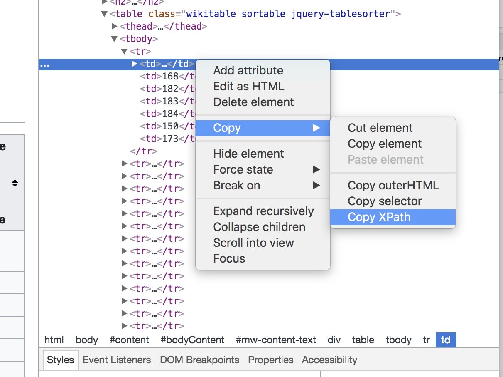

<br> \*\* Reference: Some of the source code from [Bail (2020) Text as
Data Course](https://cbail.github.io/textasdata/Text_as_Data.html)\*\*

```{r,setup, messages=FALSE, include=FALSE}
pacman::p_load(tidyverse,rvest,janitor, robotstxt, knitr)

```

## **What is Web Scraping?**

Web scraping (aka screen-scraping) refers to the process of
automatically extracting data from web pages, and often a long list of
websites that cannot be mined by hand. As the figure below illustrates,
a typical screen-scraping program:

-   collects the `html` data from a webpage

-   selects the desired piece of information in the `html nodes`

-   grabs the specific data required

-   processes the information in a convenient format such as a `data frame`

<br>


<br><br>

## **Is Screen-Scraping Legal?**

In the early years of the internet, screen-scraping was a very common
practice because there were not yet widespread legal norms surrounding
the protection of data on the internet.

This has changed drastically in recent decades as the value of data on
websites has become obvious, and bots or automated computer programs can
easily wreak havoc by collecting data from websites and repurposing it
for nefarious purposes. The very first thing you should consider before
screen-scraping a website is whether you are allowed to do so. <br> <br>

```{r echo = FALSE, out.height="70%", out.width="70%", purl=FALSE}
knitr::include_graphics("../figures/check_permissions.png")
```

<br>

The easiest way to do this is with some code - nowadays, many websites
have a robotstxt page which details whether they forbid scraping.

You can access this using the `paths_allowed("url")` function from the
`robotstx` package.

### Check permission

In the following code, we check the permission for the websites we are
going to use in this tutorial:

```{r}
robotstxt::paths_allowed("https://en.wikipedia.org/")

robotstxt::paths_allowed("https://www.imdb.com/")

```

## **Reading a Web-Page into R**

```{r echo = FALSE, out.height="50%", out.width="50%", purl=FALSE}


```

If you've identified a web page you'd like to scrape, the first step in
writing a screen-scraping program is to download the source code into R.
To do this we are going to install the `rvest` package, authored by
Hadley Wickham, which provides a number of very useful functions for
screen-scraping.

We are going to begin by scraping [this very simple web page from
Wikipedia](https://en.wikipedia.org/wiki/World_Health_Organization_ranking_of_health_systems_in_2000).

I describe the page as "simple" because it does not have a lot of
interactive features which require sophisticated types of web
programming such as javascript.

This is what the webpage linked above looks like to us when we visit it
via a browser such as Explorer or Chrome:

<br><br>  <br><br>

But this is not what the web page actually looks like to our browser. To
view the "source code" of the web page, we can use Chrome's dropdown
menu called "developer" and then click "View Source." We then see the
page in its most elemental form, called an HTML file, which is a long
file that contains both the text of the web page as well as a long list
of instructions about how the text, images, and other components of the
webpage should be rendered by the browser:

<br><br> 

<br><br>

To download the source code into R, we can use the `read_html` function
from the `rvest` package that we just installed above:

```{r, messages=FALSE, echo=FALSE, message=FALSE, waning=FALSE}
library(rvest)
```

```{r}

wiki_page<-read_html("https://en.wikipedia.org/wiki/World_Health_Organization_ranking_of_health_systems_in_2000")
```

To verify that our code worked, we can "browse" the `wiki_page` object
that we just created:

```{r}
wiki_page
```

As this output shows, we have successfully loaded the web page into our
R Studio session.

## **Parsing HTML**

```{r echo = FALSE, out.height="50%", out.width="50%", purl=FALSE}


```

<br>

Perhaps the most challenging part of web-scraping is extracting the
piece of information you want out of the html file. This is challenging
because this information is almost always hidden deep within the source
code, which can be very difficult to navigate. Fortunately, as the
figure below shows, web page source code such as HTML or XML has a "tree
like" structure that allows you to gradually hone in on the part of the
web page where the information you want lives. The boxes in the diagram
below are known as nodes.

<br><br>  <br><br>

## Quick and easy table scraping

<br>

```{r echo = FALSE, out.height="50%", out.width="50%", purl=FALSE}

```

<br> The next step after reading in the html is to isolate the correct
nodes.

The following code is a quick and easy way to scrape tables from any
wikipedia page. It is quick and easy, which means you will need to do a
fair amount of cleaning up. Later on we will look at a more precise
method that requires less cleaning.

After reading the html, we can by default choose the "table" nodes and
pass them onto the `html_table` function. This will return all the
tables on the page in a list.

```{r}
## read in the url
wiki_page <- "https://en.wikipedia.org/wiki/World_Health_Organization_ranking_of_health_systems_in_2000"

## isolate the table nodes
wiki_table <- wiki_page %>% 
read_html %>% 
  html_nodes("table") %>% 
  # automatically fill rows with fewer than the max number of columns with NAs
  html_table(fill = TRUE) 

class(wiki_table)
length(wiki_table)
```

In order to clean up this table into a nice dataframe, we need to first
`pluck` the correct table out of the list, clean up the column names
with the `janitor::clean_names` function, and check that all the
variables are of the correct type.

```{r}
# cleaning up
wiki_table <- wiki_table %>% 
  ## choose the first table in the list
  purrr::pluck(1) %>% ## this is equivalent to .[[1]] %>% 
  # clean the column names
  janitor::clean_names()
# check variable
glimpse(wiki_table)
```

A visual check of all the columns after country show that the data has
been correctly read as integers, so no more cleaning up is required.

## Tidying up after scraping

```{r echo = FALSE, out.height="50%", out.width="50%", purl=FALSE}

```

<br> Quite often, the table you scrape is not immediately usable, in
which case you will need to wrangle the data using some familiar `dplyr`
functions you have seen before.

Let's look at another example from
[wikipedia](https://en.wikipedia.org/wiki/List_of_highest-grossing_films_in_the_United_States_and_Canada):

```{r}
## read in the url
wiki_page <- "https://en.wikipedia.org/wiki/List_of_highest-grossing_films_in_the_United_States_and_Canada"

## isolate the table nodes
wiki_table <- wiki_page %>% 
read_html %>% 
  html_nodes("table") %>% 
  html_table(fill = TRUE)

class(wiki_table)
length(wiki_table)
```

This gives a much larger list, but we'll try plucking the first table
anyway:

```{r}
# cleaning up
wiki_table <- wiki_table %>% 
  ## choose the first table in the list
  .[[1]] %>% # equivalent to purrr::pluck(1) 
  # clean the column names
  janitor::clean_names()
# check variable
glimpse(wiki_table)
```

There are two problems here. First, the first row in each column looks
like parts of the column names from the table. Secondly, and as a
result, it has read in all the variables as character vectors, but all
but the title should be numerical.

We can fix that with some `dplyr` and `readr` functions:

```{r}
# cleaning up continued
## remove the first row
wiki_table <- wiki_table[-1,] 

# mutate to the correct variable types 
wiki_table <- wiki_table %>%
  # mutate the following columns by parsing as numbers 
  # (using readr::parse_number())
  mutate(
    rank = parse_number(rank),
    initial_gross_unadjusted = parse_number(initial_gross_unadjusted),
    lifetime_gross = parse_number(lifetime_gross),
    lifetime_gross_2 = parse_number(lifetime_gross_2),
    year = parse_number(year)
  )
wiki_table %>% head
```

## More precise table scraping

```{r echo = FALSE, out.height="50%", out.width="50%", purl=FALSE}

```

<br>

In many the cases, the quick and easy way of scraping tables outlined
above will work fine. Just remember, you may need to check the correct
value of `n` for when you add `purrr::pluck(n)` or `.[[n]]` to the pipe
chain.

If need be, however, there are ways to be more precise in selecting
which table you want to scrape on a webpage by finding out the location
of the table (its `xpath`) within the html data. For the following
example, we are going to look at another [wikipedia
page](https://en.wikipedia.org/wiki/World_Health_Organization_ranking_of_health_systems_in_2000)
which has the ranking of health care systems around the world.

In order to find out where the data we want is located within the html
structure, we can use a handy tool within Chrome called "Developer
Tools":

<br><br>

```{r echo = FALSE, out.height="80%", out.width="80%", purl=FALSE}

```

<br><br>

This tool provides you with an interactive interface where you can view
the webpage alongside the source code. When you right click on the part
of the web page you are interested in and choose "inspect", the
Developer Tool highlights the part of the source code where the
information you want is located. In the figure below, I have highlighted
the table that describes health metrics for different countries that are
described on the Wikipedia page linked above.

<br><br>

```{r echo = FALSE, out.height="80%", out.width="80%", purl=FALSE}

```

<br><br>

When I inspected the part of the web page I am trying to scrape by
right-clicking, the part of the HTML below became highlighted:

<br><br>

```{r echo = FALSE, out.height="80%", out.width="80%", purl=FALSE}

```

<br><br>

Sometimes, finding the exact part of the code where the data you want
lives requires some trial and error. In this case, I discovered that I
had to select an earlier line in the code to identify the entire table I
want to scrape instead of just one line.

The next step is to identify a string of numbers and letters called the
"Xpath" for this part of the source code. The Xpath describes the
precise part of the HTML where the data I want lives. I identify the X
path by right clicking on the highlighted section of the pane of the
Developer Tools that displays the html code:

<br><br>

```{r echo = FALSE, out.height="80%", out.width="80%", purl=FALSE}

```

<br><br>

Now that I have the xpath, I can use this information to narrow my
search within the HTML file for the Table that I want to extract using
the `html_nodes` function which passes the xpath as an argument as
pictured in the code below for the WHO table:

```{r}
## read in the url
wiki_page <- "https://en.wikipedia.org/wiki/World_Health_Organization_ranking_of_health_systems_in_2000"

## save the xpath - using single quotes!
xpath <- '//*[@id="mw-content-text"]/div[1]/table[1]'

wiki_table <- wiki_page %>% 
  read_html %>% 
  html_nodes(xpath = xpath) %>% 
  html_table(fill = TRUE) %>% 
  purrr::pluck(1) %>% 
  janitor::clean_names()

health_rankings <- wiki_table
head(health_rankings)
```

And again for the movie table:

```{r}
## read in the url
wiki_page <- "https://en.wikipedia.org/wiki/List_of_highest-grossing_films_in_the_United_States_and_Canada"

## save the xpath - using single quotes!
xpath <- '//*[@id="mw-content-text"]/div[1]/table[1]'

wiki_table <- wiki_page %>% 
  read_html %>% 
  html_nodes(xpath = xpath) %>% 
  html_table(fill = TRUE) %>% 
  purrr::pluck(1) %>% 
  janitor::clean_names()

movie_rankings <- wiki_table
head(movie_rankings)
```

As the output above shows, I now finally have the data I wanted in the
form of data frames called **health\_rankings** and **movie\_rankings**.

#### *Challenge: scrape a table from another page on Wikipedia*

Remember that one of the best ways to learn and use code is to copy,
paste and tweak.

Find another table on Wikipedia for a topic you are interested in, then
use the code below and change the urls, variables and variable names as
necessary.

```{r}
## Copied from above

## read in the url
wiki_page <- "https://en.wikipedia.org/wiki/List_of_highest-grossing_films_in_the_United_States_and_Canada"

## save the xpath - using single quotes!
xpath <- '//*[@id="mw-content-text"]/div[1]/table[1]'

wiki_table <- wiki_page %>% 
  read_html %>% 
  html_nodes(xpath = xpath) %>% 
  html_table(fill = TRUE) %>% 
  purrr::pluck(1) %>% 
  janitor::clean_names()

df_name <- wiki_table
head(df_name)
```
