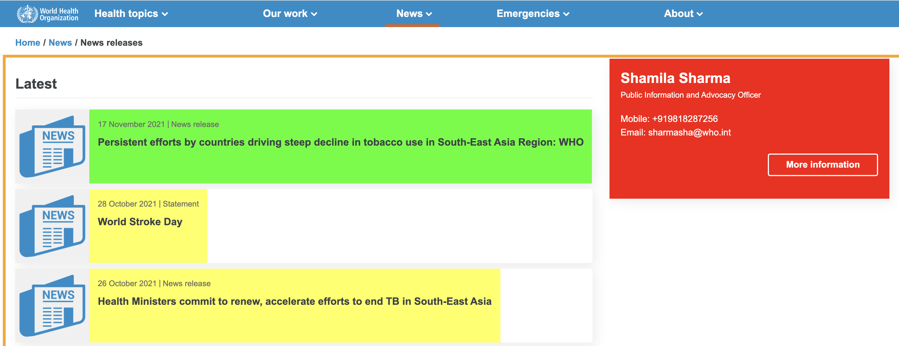

<br> \*\* Reference: Some of the source code from [Bail (2020) Text as
Data Course](https://cbail.github.io/textasdata/Text_as_Data.html)\*\*

```{r setup, messages=FALSE, include=FALSE}
pacman::p_load(tidyverse,rvest,janitor, robotstxt, here, glue)

```

## **Reminder**


Web scraping refers to the process of
automatically extracting data from web pages, and often a long list of
websites that cannot be mined by hand. As the figure below illustrates,
a typical screen-scraping program 

-   collects the `html` data from a webpage

-   selects the desired piece of information in the `html nodes`

-   grabs the specific data required

-   processes the information in a convenient format such as a `data frame`

<br>


## **Parsing with the CSS Selector**

```{r css image, echo = FALSE, out.height="70%", out.width="70%", purl=FALSE}

```

In **Part I** we looked at getting data from website tables. It is often the case---particularly with more complex web pages--- that
the procedures described then will not work. Most data online is not
already put into tables, in which case it is useful to know about an
alternative to the xpath code described before: the "CSS Selector".

CSS Selector is another snippet of code that helps you find the nugget of HTML you
want to extract from a web page.

Let's look at an example of scraping a list of questions from the [WHO newsletters page for South East Asia](https://www.who.int/southeastasia/news/releases). If you visit the [WHO website](https://www.who.int/), you will see that the example is
considerably more complex than the aforementioned Wikipedia example.
There are not only more types of information presented on the page but
multiple ways of accessing it.

In order to identify the CSS Selector, we are going to employ a popular
Chrome plug-in called the [Selector Gadget](http://selectorgadget.com/).
This is an interactive tool---not unlike the Chrome Developer Tool
described above--- that allows one to interact with a web page in order
to reveal the CSS Selector. 

After installing the tool, a small icon will appear in your Chrome toolbar that is a hand holding a microscope. When you click on this tool, a new pane will appear at the bottom of your
browser window that will eventually reveal the CSS Selector-- it can
also be used to identify the xpath, incidentally. 

This pane is pictured
at the bottom of the figure below:

<br><br> 

To reveal the CSS selector for the part of the page you want, click on
that part of the page. The part of the page should appear highlighted in
Green. However, you will most likely also see other parts of the page,
highlighted in yellow, these are all the parts of the web page that the
selected CSS code will scrape:

<br><br> 

Click on one of the yellow parts that you do not want, it will turn red.
Do this until you see only the parts you want highlighted in green or
yellow. 

In this case, I just want to grab the newsletter titles first.

As you click, you may note that the CSS Selector that is
selected at the bottom of the page changes. This can take some trial and
error, and the Selector Gadget is imperfect. One hint to look at how many objects it is capturing - this can be found in parentheses next to the Clear button.

Once we have identified the CSS selector we think is attached to the
piece of information we want, we can pass it as an argument in `rvest`'s
`html_nodes` function as follows:

```{r who news titles}
## collect the html data
who_news <- read_html("https://www.who.int/southeastasia/news/releases")


news_titles <-
## select the nodes by CSS
  html_nodes(who_news, css=".text-underline") %>% 
## grab the text
html_text()

news_titles %>% head(4)
```

As the output above shows, we have now collected the text for the
titles we wanted. In this case, the text is already nicely formatted. In other cases, you may need to do some processing after this step.

Let's go back and see if we can scrape the dates too:
```{r who news dates}
news_dates <- 
  who_news %>% 
  html_nodes(css = ".timestamp") %>% 
  html_text(news_titles)
news_dates
```

The resulting vector is a list of dates, but stored as character variables. We can process that with a `lubridate` function:


```{r lubridate image, echo = FALSE, out.height="70%", out.width="70%", purl=FALSE}

```


```{r lubridate who dates}
news_dates <- 
  news_dates %>% lubridate::dmy()

news_dates
```

>
> What do you think dmy() stand for?
>

## Getting links from a website

```{r href image, echo = FALSE, out.height="70%", out.width="70%", purl=FALSE}

```
<br>

One more thing that might be useful for more advanced scraping is grabbing some of the links from the page as we might want to use them later in a more advanced, multi-level scrape.

To do this we need to grab the attributes of the nodes, specifically the **"href"** (hyperlink reference), rather than the `html` text. After a bit of trial and error, I found the best way to grab the links was with an `xpath` selector rather than the `css.`

```{r news_links}
news_links <-
## select the nodes by xpath
  html_nodes(who_news, xpath='//div[2]/div/div/div/div[1]/div[2]/div/a') %>% 
## grab the text
html_attr('href')

```

Now we can put all three values into a tibble.

```{r tibble who_news}
who_news <- 
  tibble(headline = news_titles,
         date = news_dates,
         url = news_links)

who_news
```

And finally let's put them into a csv file and save them for a later date:

```{r write csv}
write_csv(who_news, file = here::here("data","who_news.csv"))
```


## **Example Scraping from IMDb**

The [IMDb](https://www.imdb.com/) is an online database of information
related to films, television programs and video games. It contains a lot
of information about each show, including a list of cast members,
summaries of the plot and user reviews.

In this example, let's look at the popular US TV comedy programme
Friends.

 It is possible to look at the details for
each season of Friends on separate pages. Let's look at [Season 1]
(<https://www.imdb.com/title/tt0108778/episodes?season=1>) to start
with.

On the Season 1 page, we can find a lot of information, including:

-   the title of each episode
-   the date the episode was first shown
-   average user review ratings out of 10
-   how many votes for each rating
-   a brief plot summary

#### *Challenge: Use the Selector Gadget to find the CSS code for each item*

Find the CSS codes using the Selector Gadget Chrome extension, and add
them as variables to the code below.　The variables should be saved as
character **strings**, so make sure you put them between quotation marks
("").

You should then un-comment the code (remove the \#s) to run the code and
save the variables.

```{r practice css}
# title <- 
# airdate <- 
# plot <- 
# rating <- 
# votes <- 

  
```

In the Wikipedia example above, we used `html_table` to select the table
from the html nodes. When dealing with text data, like the ISS FAQ page,
you should use `html_text` instead. Quite often, text data will have
extra white spaces around the beginning or end, so you can use the
`trim = TRUE` arguemnt to trim, or cut, these white spaces. Let's look
at an example by grabbing the text for season from the IMDb page.

```{r grab season}

html <- read_html("https://www.imdb.com/title/tt0108778/episodes?season=1")

season <-  html_nodes(html,"#episode_top") %>%
    html_text(trim= TRUE)

season
```

Following this principle, we can make a dataframe for all of Season 1 by
using `html_text()` on all of the variables we created using the
Selector Gadget tool. Complete the code below with either the variable
names you just created, or the CSS codes within quotation marks.

Remember you will need to un-comment the code in order to run it.

```{r practice scrape to df}
  # # isolate the desired data

  # title <- html_nodes(html, ____) %>% 
  #  html_text(trim = TRUE)

  # air_date <- html_nodes(html, ____) %>% 
  #   html_text(trim = TRUE) 

  # plot <- html_nodes(html, ____) %>% 
  #  html_text(trim = TRUE)

  # rating <- html_nodes(html, ____) %>% 
  #   html_text(trim = TRUE) 
  
  # votes <- html_nodes(html, ____) %>% 
  #   html_text(trim = TRUE) 

  # # make a df for the season using tibble()

  # df <- tibble(season, air_date, title, plot, rating, votes)
  # df 
```

Note that the code above saves all the data as text data - character
strings that will not be understood as numbers or dates by R unless we
convert them. To do this we can use a few `Base R`, `readr` and `lubridate`
functions, such as:

-   `base::as.numeric()`to convert character strings to numerical values
-   `readr::parse_number()` to drop non-numerical characters, then convert the
    rest to numerical values
-   `readr::parse_date()` to convert dates from a specified format into date
    values
-   `readr::type_convert()` to let `readr` guess the preferred variable type
-   `lubridate::dmy()` to convert from text to date format

We will look at these examples in some code below

## **Web-scraping within a Loop**

```{r automate image, echo = FALSE, out.height="70%", out.width="70%", purl=FALSE}

```

<br>

Regardless of which approach to web-scraping you use, you will often
want to scrape not just one page, but many pages. In this case, you can
simply embed any of the techniques above within a `for` loop that reads
a list of web pages you wish to scrape.

A `for` loop is a common concept in most computer languages, and it
allows you to run the same code over a number of elements in turn.

<br>
```{r loop image, echo = FALSE, out.height="70%", out.width="70%", purl=FALSE}

```
<br>

This means that when it comes to scraping
the data for all the seasons of Friends, we need to find a way to put
the seasons as a sequence, and then repeat the code we used above for
each item in the sequence in turn. As R is based around the principle of
`vectors`, it is a natural step to use `for` loops when writing code.

So what are the urls for each season of Friends? If you click in on
another season, you will see that the url has not changed much, and that
only the final part `season=1` changes. We can take advantage of that in
the following code.

One other thing to pay attention to is that each time you complete a
`loop`, you will be creating a new dataframe. The easiest way to put
these together is by placing all the dataframes into a `list` object
first, and then combining the dataframes by `binding` the rows together.

```{r create friends loop}


# list of seasons
season = seq(1,10)

# empty list to store dataframes
df_list = list()

# start the loop here i begins at 1, and finishes at the end of the vector seasons (10)
for (i in season) {
  
  # define url, using glue for combining strings
  base_url <- "https://www.imdb.com/title/tt0108778/episodes?season="
  season_url <- glue::glue("{base_url}{i}")
  
  # go get the html
  html <- read_html(season_url)
  
  # isolate the desired data
  season <- html_nodes(html,"#episode_top") %>%
    html_text(trim= TRUE)
  title <- html_nodes(html, "#episodes_content strong a") %>% 
    html_text(trim = TRUE)
  plot <- html_nodes(html, ".item_description") %>% 
    html_text
  rating <- html_nodes(html, ".ipl-rating-star.small .ipl-rating-star__rating") %>% 
    html_text(trim = TRUE) %>% 
    as.numeric() # convert to numerical values
  votes <- html_nodes(html, ".ipl-rating-star__total-votes") %>% 
    html_text(trim = TRUE) %>% 
    readr::parse_number() # to drop non-numerical characters and convert to numerical values
  air_date <- html_nodes(html, ".airdate") %>% 
    html_text(trim = TRUE) %>% 
     stringr::str_remove("[.]") %>% # remove periods from the months Sept. etc
    lubridate::dmy() # to convert to date values

  
  # make a tibble for each season 
  df <- tibble::tibble(season, air_date, title, plot, rating, votes) 
  
  # add to list
  df_list[[i]] <- df # this puts our dataframe into the ith position of the list
}

# combine the list into one tibble
friends <- dplyr::bind_rows(df_list) # combine all the dataframes into one by binding the rows

friends 

```

## **Making a web-scraping function**

The next step up is to make a function which would allow you to scrape
**any** TV show plot and ratings from the IMDb website. Let's have a
look at the Friends IMDb url again:
<br>.
```{r echo = FALSE, out.height="70%", out.width="70%", purl=FALSE}

```
<br>
As we saw earlier, we can loop through the
seasons for Friends by changing the green part in the image above, by
changing `season=1` to `season=2`, for example. The blue part of the url
is fixed for all TV shows on IMDb, so the middle red part is the code
for each individual TV show.

With that in mind, we can make a function in R where you simply input
the codes for the TV shows and number of seasons, and then the function
could run a `for` loop as before to produce a dataframe with the TV
shows details.


But this time we are going to use a `purrr::map` function instead of a
loop to automate the process. The basic idea behind `map`is that you
apply a function **for each** element in a list (which could be a list object, or a data
frame, or a vector).

## **Web-scraping with purrr::map**

To introduce the idea of **mapping functions**,  let's think again about getting permission to scrape a website.

>
> How can you check whether it is okay to scrape a website?
>

Let's say you have a list of websites you would like to scrape. You can
put them into a vector, and then `map` the function `paths_allowed` from
the `robotstxt` package **for each** element in the vector:

```{r map paths}
urls <- c("https://en.wikipedia.org/","https://www.imdb.com/", "https://www.amazon.co.uk/", "https://www.worldbank.org/", "https://www.who.int/")

urls %>% map(robotstxt::paths_allowed)
```

The result comes back in a list form. You can choose what kind of object is returned by the `map` family of functions:

-   `map_lgl()` makes a logical vector.
-   `map_int()` makes an integer vector.
-   `map_dbl()` makes a double vector.
-   `map_chr()` makes a character vector.
-   `map_df()`  makes a data frame (needs column names to work).

```{r map_logl paths}
urls %>% map_lgl(robotstxt::paths_allowed)
```

The code above can be read as:

>
> Take **urls**, then **map** to a **logical** vector `paths_allowed`.
>

You can also `map` your own original functions.

```{r map remove_https}
## Remove https from url
remove_https <- function(url){
  str_remove(url, pattern = "^https:[/]+")
}

urls %>% map_chr(remove_https)
```
>
> The code above can be read as "Take **urls**, then **map** to a **character** vector `remove_https`.)
>

Or combine them in a pipe:

```{r map_chr UPPER}
## Remove https from url 
## Change to upper case
urls %>%
  map_chr(remove_https) %>%
  map_chr(str_to_upper)
```

>
> How would you read this code?
>


```{r map_chr CHALLENGE}

## CHALLENGE: pipe an extra line to remove the final / too!
urls %>%
  map_chr(remove_https) %>%
  map_chr(str_to_upper)

```

In this way we can automate the web-scraping process by first creating our scraping function, and then mapping it onto a list of seasons.

<br>
```{r echo = FALSE, out.height="70%", out.width="70%", purl=FALSE}

```
<br><br>

Let's have a look at how we can make a function to map for our
webscraping needs. First we define the function. It is similar to the one we made for the Friends webpage above, but a bit simpler as there is no need to include the `i` for iteration.

```{r create grab_imdb}
library(rvest)
## make the function
grab_imdb <- 
 function(code,season = 1){
  # define the base url
  url <- glue::glue("https://www.imdb.com/title/{code}/episodes?season={season}")
  
  # Grab the html data
  raw_html <- read_html(url)
  
  # Select the specific nodes for episode info
  raw_div <- raw_html %>% 
    html_nodes("div.list.detail.eplist") %>% 
    html_nodes("div.info")

  # Get the episode number (hidden as a meta node)
  ep_num <- raw_div %>% 
    html_nodes("meta") %>% 
    html_attr("content")
  
  # Get the title
    title <-  raw_div %>% 
    html_nodes("strong a") %>% 
    html_text()  %>% 
    str_squish()
  
  # Get the air_date
  air_date <- raw_div %>% 
    html_nodes("div.airdate") %>% 
    html_text() %>% 
    str_squish() %>% 
    # convert to date format
    lubridate::dmy()
  
  # Get the ratings
  rating <- raw_div %>% 
    html_nodes("div.ipl-rating-star.small > span.ipl-rating-star__rating") %>% 
    html_text()
  
  # Get the ratings count (votes)
  votes <- raw_div %>% 
    html_nodes("div.ipl-rating-star.small > span.ipl-rating-star__total-votes")%>% 
    html_text() %>% 
    str_remove_all("\\(|\\)|,")
  
  # Get the plot description 
  plot <- raw_div %>% 
    html_nodes("div.item_description") %>% 
    html_text() %>% 
    str_squish()
  
  # Put them together in a tibble
  df <- tibble(season, ep_num, title, air_date, rating, votes, plot)  
    
  # Let readr guess the variable types
 df <- suppressMessages(type_convert(df))
  
}
```

Running the code above will create a new function in your `Functions`
part of the RStudio Environment. Let's see the function in action using
Game of Thrones as an example. From the IMDb page we can see that Game
of Thrones had 8 seasons and the TV show code from the url is
`tt0944947`.

Input those details in the code below, and see if the function works.
Remember to un-comment the code before running it:

```{r CHALLENGE}

# specify the imdb code
code <- "tt0944947"
# test with 3 seasons
seasons <- 1:3

# map the grab_imdb function

```
If you had some problems, it might be because when you `map`, there are some specific code arguments that you need to remember. 

When you are using your own function, or when you are using a function with specific arguments, you should put the `~` symbol in front of the function. You should also refer to the **for each** element you are mapping within the function as `.x`.

Compare:

```{r fail paste}
## Try to add the text "Website link:" to each url
urls %>% map(paste("Website link:"))
```
With:

```{r map paste}
# Map the text "Website link:" to each url
urls %>% map(~paste("Website link:", .x))
```

The first one fails and results in empty (`NULL`) results because the function `paste()` has a specific argument. Because of that `map` doesn't know what function to map, nor how to deal with **for each** element of `urls`.

The second one solves the problem by telling `map` what the function is with the `~` sign, and positioning  where to paste **for each** element with `.x`.

>
> To read the second one aloud, you can say "take **urls**, then **map** the **function** paste      "Website link:" **for each** url.
>

Also, remember you can choose what type of output you want in the `map` family. In this case, a character vector is probably most appropriate.

```{r map_chr paste}
urls %>% map_chr(~paste("Website link:",.x))
```

When it comes to the imdb scraping, we want to return a `tibble` dataframe, so we can use `map_dfr` to map the function, into a **df** (dataframe) joined by **r** rows. The value we want to map is the seasons, and the argument we want to specify is the imdb code

```{r test grab imdb}

# specify the imdb code
code <- "tt0944947"
# test with 3 seasons
seasons <- 1:3

# map the grab_imdb function
seasons %>% 
  map_dfr(~grab_imdb(code = code, season = .x))
```

>
> This code can be read as "Take **seasons**, then **map** to a **dataframe** (by row) the (imdb) `code` **for each** `season.`"
>

Before we get into some text analysis, let's see if we can visualise the
results of some of the numerical values in our data.

In the code below, I have created a dataframe called `GoT` using the new
grab_imdb function. From that dataframe, we can use `ggplot`
to create a graph showing how the ratings fluctuate over the seasons.

Remember that we can use a `geom-line` graph to show change over time,
and a `geom_point` graph to visualise three values, an x value for the
date, a y value for the rating, and a size value for some other variable
(in this case the number of votes for the ratings).

We can use the `facet_wrap` function to separate the graphs by season,
with an extra argument of `scales = "free_x"` so that each faceted graph
can have a different x-axis value. You can experiment by removing the
facet_wrap line of code, or deleting the `scales = "free_x"` argument
to see how it affects the readability of the graph.

```{r}
# load libraries
library(ggplot2)

code <- "tt0944947"
# Save as a dataframe
GoT <-  1:8 %>%
  map_dfr(~grab_imdb(code, season = .x))

## Use ggplot to plot the results
GoT_plot <- GoT %>% 
  dplyr::mutate(season = factor(season)) %>% 
  ggplot2::ggplot(aes(air_date, rating)) +
    # geom_smooth(color = "#dddddd", se = FALSE, linetype = "dashed") +
    geom_line(aes(group = season, color = season), alpha = 0.4) +
    geom_point(aes(color = season, size = votes), alpha = 0.4) +
    scale_color_brewer(palette = "Dark2") +
    labs(x = "",
         y = "IMDb Rating",
         size = "# IMDb Users",
         color = "Season",
         caption = "Source: IMBb") +
  facet_wrap(~season, scales = "free_x") +
  theme(legend.position = "none") 

GoT_plot +
  ggplot2::labs(title = "Winter came, and it was rated badly!",
       subtitle = "Weighted Average IMDb Ratings for 'Game of Thrones'")
```

#### *Challenge: Exploring further*

Finally, why not experiment with the code chunk below and try some the
challenges listed.

```{r}
## Going further

## Challenge 1 - find another TV show that you like on IMDb, and use the grab_imdb function on it - can you make a plot of the results?

## Challenge 2 - do some statistical analysis on the GoT data: is there a significant difference in the average ratings by season? (Think of season as categorical data). Do people tend to vote on episodes they like? (Is there a correlation between number of votes and rating scores?)
```


```
